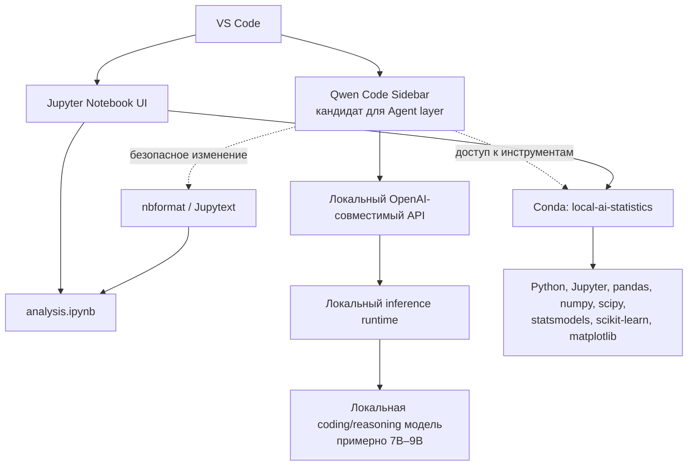

# Архитектура

Целевая система разделяет пользовательский интерфейс, слой агента, inference, модель и среду выполнения. На текущем этапе эти решения документированы, но runtime, модель и VS Code AI-интеграция ещё не выбраны и не установлены.

## Слои

1. **UI layer.** VS Code предоставляет обычный Jupyter Notebook UI. Пользователь открывает и вручную редактирует `analysis.ipynb`, запускает ячейки и видит outputs. Рядом расположен sidebar агента.
2. **Agent layer.** Основной кандидат — официальная Qwen Code-интеграция для VS Code. Она должна предоставить agent mode, контекст workspace, diff, чтение и изменение файлов, terminal и доступ к Python. Qwen Code не является моделью и не заменяет runtime.
3. **Inference layer.** Выбранный позднее локальный runtime публикует API на `localhost`, совместимый с OpenAI API. Он отделяет UI и агента от конкретного движка.
4. **Model layer.** Одна выбранная локальная coding/reasoning модель ориентировочно класса 7B–9B. Её можно заменить независимо от VS Code UI при сохранении контракта локального API.
5. **Execution/Data Science layer.** Conda-окружение `local-ai-statistics` содержит Python, Jupyter и библиотеки анализа данных. Агент получает к нему контролируемый доступ для запуска кода, наблюдения результатов и исправления ошибок.

## Работа с notebook

`.ipynb` — главный пользовательский документ. Агент не должен вручную собирать или править сырой JSON notebook. Для программного изменения применяются `nbformat`, Jupytext либо другой надёжный API, после чего notebook валидируется и выполняется в рамках соответствующей задачи.

## Целевой цикл агента

Агент читает notebook и данные, анализирует задачу, безопасно изменяет notebook, запускает Python/Jupyter, наблюдает output, исправляет ошибку при необходимости, повторно запускает код и добавляет Markdown-интерпретацию. Полная проверка этого цикла запланирована отдельной задачей.
