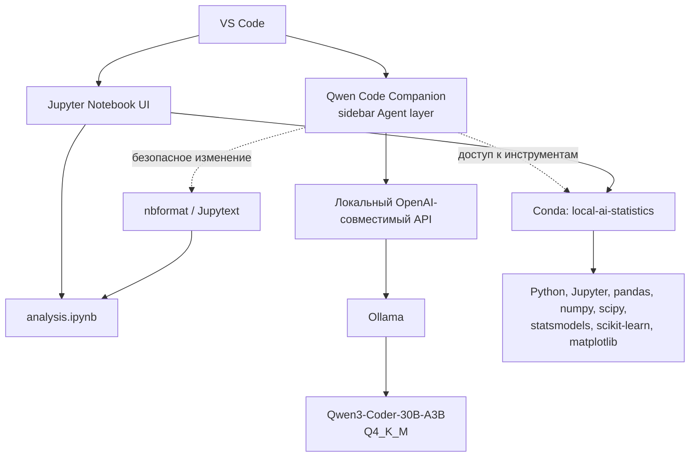

# Архитектура

Целевая система разделяет пользовательский интерфейс, слой агента, inference, модель и среду выполнения. Ollama, `qwen3-coder:30b` и Qwen Code Companion уже выбраны и установлены; соединение Agent layer с локальным endpoint выполняется в TASK-008.

## Слои

1. **UI layer.** VS Code предоставляет обычный Jupyter Notebook UI. Пользователь открывает и вручную редактирует `analysis.ipynb`, запускает ячейки и видит outputs. Рядом расположен sidebar агента.
2. **Agent layer.** Выбрано официальное расширение Qwen Code Companion 0.23.3. Оно предоставляет sidebar, workspace/file/selection context, native diff, file tools и shell через bundled Qwen Code. Qwen Code не является моделью и не заменяет runtime.
3. **Inference layer.** Ollama — выбранный runtime. Он присутствует вне репозитория и подтверждён на `127.0.0.1:11434`: `/api/version`, `/api/tags` и OpenAI-совместимый `/v1/models` отвечают с одной локальной моделью. Project-owned launchers не меняют существующий процесс и запускают новый процесс только с loopback и `OLLAMA_NO_CLOUD=1`. API отделяет UI и агента от конкретной модели.
4. **Model layer.** Установлена одна локальная coding/reasoning модель `qwen3-coder:30b`, Q4_K_M. Её можно заменить независимо от VS Code UI при сохранении контракта локального API и отдельном документированном решении.
5. **Execution/Data Science layer.** Conda-окружение `local-ai-statistics` содержит Python, Jupyter и библиотеки анализа данных. Агент получает к нему контролируемый доступ для запуска кода, наблюдения результатов и исправления ошибок.

## Работа с notebook

`.ipynb` — главный пользовательский документ. Агент не должен вручную собирать или править сырой JSON notebook. Для программного изменения применяются `nbformat`, Jupytext либо другой надёжный API, после чего notebook валидируется и выполняется в рамках соответствующей задачи.

## Целевой цикл агента

Агент читает notebook и данные, анализирует задачу, безопасно изменяет notebook, запускает Python/Jupyter, наблюдает output, исправляет ошибку при необходимости, повторно запускает код и добавляет Markdown-интерпретацию. Полная проверка этого цикла запланирована отдельной задачей.

## Зафиксированное решение runtime

Причины выбора Ollama, сравнение с `llama.cpp` и vLLM, а также ограничения Radeon 780M описаны в [ADR-001](adr/ADR-001-runtime-selection.md). Выбор Agent layer и его ограничения описаны в [VSCODE_AGENT.md](VSCODE_AGENT.md).
